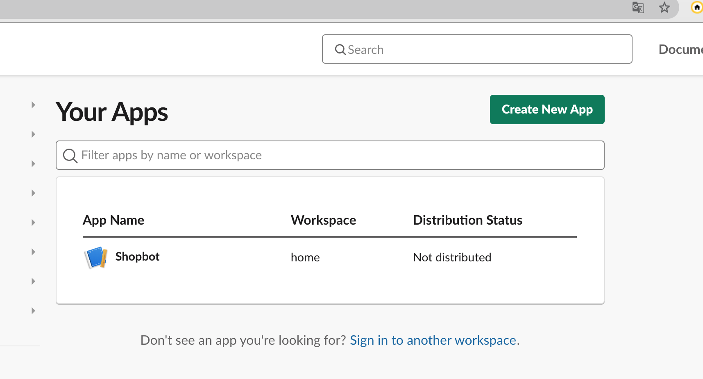
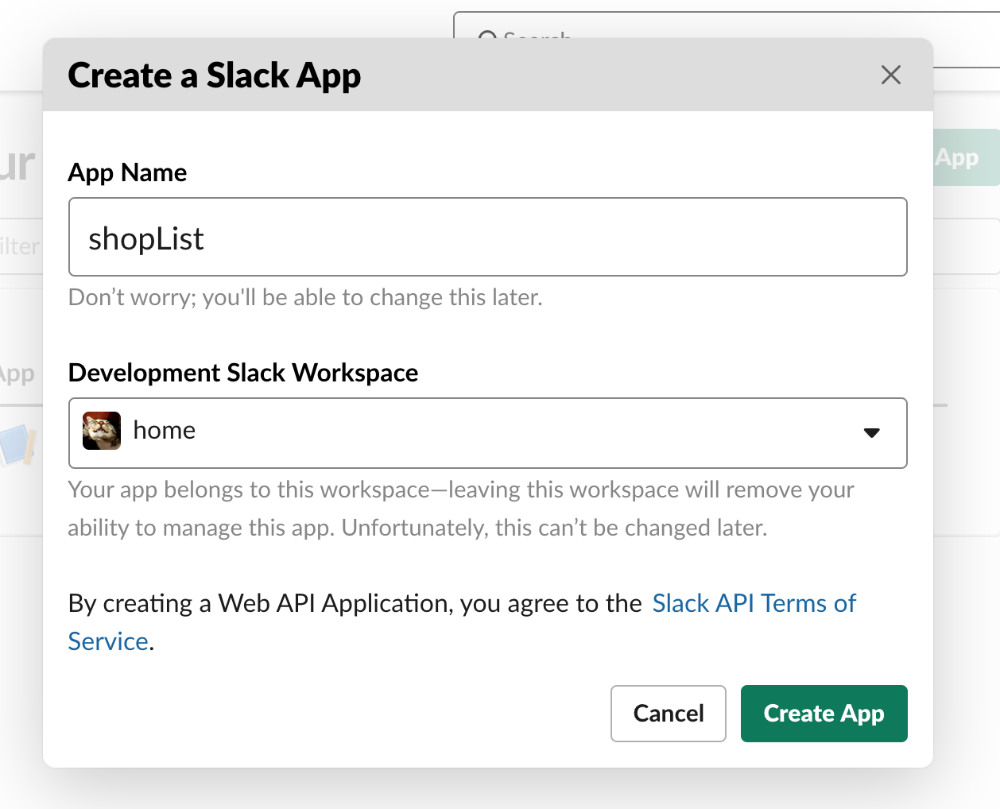

# How to develop a Slack Bot App

## Creating a Slack Application & Bot

1) Go to https://api.slack.com/apps
2) Click 'Create a new app', select a name for your bot, and select the workspace to which you want to connect the bot.

