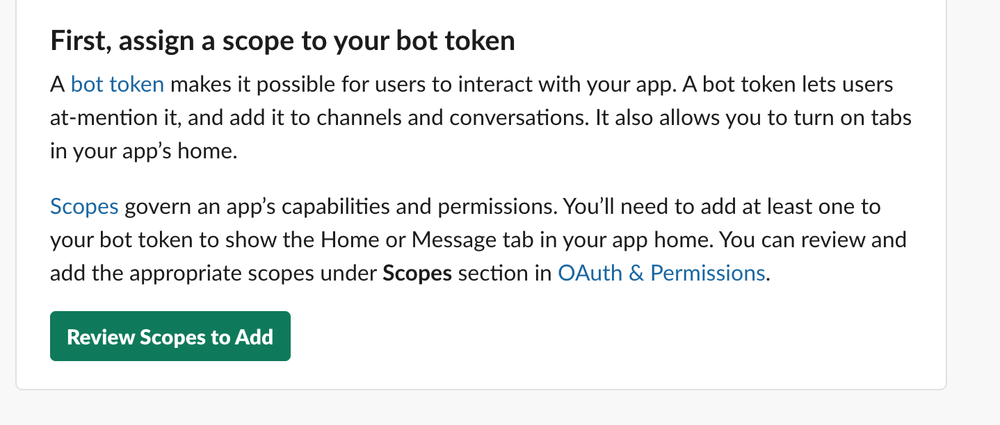

# How to develop a very basic Slack Bot App

This document contains steps for setting up a very basic slack up that uses Block Kit elements.  
It is meant as a first steps guide to get an overview of the different components that are required for this.  

I used [these steps](https://www.javascriptjanuary.com/blog/building-a-slack-app-with-express-and-the-node-sdk) written by Daria Caraway as a base, and Daria's article has much more detail than the below rough guide.
 However, some steps had changed a little since the article was written, so that's why I wrote up the following steps.

## Creating a Slack Application & Bot

1) Open the [Slack App configuration page](https://api.slack.com/apps).
2) Click 'Create New App', select a name for your bot, and select the workspace to which you want to connect the bot.
   
   

## Configuring your bot
First, assign some scopes to your bot.  
Scopes allow your bot to listen to at-mentions, reply to them, see channel users etc.

For this, follow these steps:
1) Go to 'App Home'
   
2) Click 'Review Scopes to Add'
   
3) Let's add the following bot token scopes to start with (these can be adjusted later:
   * `app_mentions:read`
   * `chat:write`
   * `commands`
   * `users:read`
   
4) After that, you can go ahead and install your new app to your workspace
   
   
## Setting up the Node.js App
   
1) Add the following modules (using yarn or npm):
   * Slack Node SDK Events API: `yarn add @slack/events-api`
   * Slack Node SDK web API: `yarn add @slack/web-api`
   * Slack Node Interactive Messages: `yarn add @slack/interactive-messages`
   * Express: `yarn add express`
   * Body Parser: `yarn add body-parser`
2) Create a new basic express app:
    ```
   const express = require('express');
   const bodyParser = require('body-parser');
       
   const port = process.env.PORT || 3000;
   const app = express();
       
   app.use(bodyParser.urlencoded({extended: true}));
   app.use(bodyParser.json());
       
   // Starts server
   app.listen(port, function() {
      console.log('Bot is listening on port ' + port)
   });
   ```   
3) Creating a URL for our Node Server to Accept Events:
    So you can develop locally, without having to constantly redeploy.
    Follow the steps here: https://api.slack.com/tutorials/tunneling-with-ngrok
    In the last step, run `./ngrok http 3000` (3000 matches the port in your express)
4) Create a URL endpoint to accepts the events on our Express server. Let's use this format:
  `https://[ngroc forwarding domain]/slack/events`
  this could look e.g. like this: `https://b6c1ae28.ngrok.io/slack/events`  
5) Authentication:
    Get the client signin secret under 'Basic Information':
    
    
    Then run:
   
   `$ ./node_modules/.bin/slack-verify --secret <client signin secret> https://b6c1ae28.ngrok.io/slack/events --port=3000`
   
   (if you get a 'port in already in use' error message, check if your express app is already running, and if so, stop it.)
   
6) While on the 'Basic Information' tab, save the different credentials as environment variables for later use:

```
export CLIENT_ID=xxx
export CLIENT_SECRET=xxx
export VERIFICATION_TOKEN=xxx
export CLIENT_SIGNING_SECRET=xxx
export BOT_TOKEN=xxx
```

## Enable Events:
1) Go to 'Events Subscriptions' and enable the toggle button:
   
2) Enter your events endpoint URL, e.g.: `https://b6c1ae28.ngrok.io/slack/events`  (as you develop, if your ngrok URL domain changes after restarts, you need to update this URL setting again)
3) Once this URL is verified, we can stop the ./node_modules/.bin/slack-verify server.

   
Next, we need to register to which events we want our bot to have access.

1) Click Into Subscribe to bot events
2) Click Add Bot User Event
3) Search for app_mention and add it
4) Save your changes at the bottom of the page!!!!
   
## We can code now!

We can now call on the slack events-api from our express app.
In index.js, I added (note that CLIENT_SIGNING_SECRET is taken from the environment variables):

```
const { createEventAdapter } = require('@slack/events-api');
const slackEvents = createEventAdapter(process.env.CLIENT_SIGNING_SECRET);
.
.
.
(...)

app.use('/slack/events', slackEvents.expressMiddleware());

```
    
Once that's installed, we can add an event listener:

```
slackEvents.on('app_mention', async (event) => {
  try {
    console.log("I got a mention in this channel", event.channel)
  } catch (e) {
    console.log("error: ", e)
  }
});
```  
  
Start the app using `node index.js`   
To test, invite the bot to a slack channel, and mention it in a message. 
You should see the expected console output:


## Responding to mentions  

 Add the web client to your app.
 You also need the bot-token (from the oauth section of the Slack App page), which you have saved in an environment variable in a previous step:
 
 ```
const { WebClient } = require('@slack/web-api');

const token = process.env.BOT_TOKEN;
const webClient = new WebClient(token);
```

You can quickly test if this works by updating your 'app_mention' event handler like this: 

```
slackEvents.on('app_mention', async (event) => {
  try {
    console.log(event);
    let messageBlock = {
      "channel": event.channel,
      "text": "Hello"
    };
    webClient.chat.postMessage(messageBlock)
  } catch (e) {
    console.log("error: ", e)
  }
});
```
The console.log shows you all the properties you get from the incoming event, and then you can post a messageBlock to back to the channel.

## Introducing Slack Block Kit

Now, for our bot message response, I want it to be a simple message that contains a button that launches a Block Kit modal:


```
slackEvents.on('app_mention', async (event) => {
  try {
    console.log(event);
    const messageBlock = {
      'channel': event.channel,
      'blocks': [{
        'type': 'section',
        'text': {'type': 'mrkdwn', 'text': 'Hello, thanks for calling me. Would you like to launch a modal?'},
        'accessory': {
          'type': 'button', 'action_id': 'open_modal_button', // We need to add this
          'text': {'type': 'plain_text', 'text': 'Launch', 'emoji': true}, 'value': 'launch_button_click'
        }
      }]
    };
    const res = await webClient.chat.postMessage(messageBlock);
    console.log('Message sent: ', res.ts);
  } catch (e) {
    console.log('error: ', e);
  }
});
```

## The button
Right now, nothing happens when clicking on the button in the bot's reply messag;..
Note that we passed in an `action_id` of `open_modal_button`

For this, we need to first add the Slack Interactive Messaging API to our index.js file, and set an endpoint URL, similar to what we did for events:

```
const { createMessageAdapter } = require('@slack/interactive-messages');

const slackInteractions = createMessageAdapter(process.env.CLIENT_SIGNING_SECRET);

app.use('/slack/actions', slackInteractions.expressMiddleware());
```

Then, register the new Actions Route with Slack:
1) In your app configuration page, in the navigation bar, click on `Interactivity & Shortcuts`.
2) Enable 'Interactivity':
    
3) Save the changes

Now, let's add a listener for our `open_modal_button` action_id:

```
slackInteractions.action({ actionId: 'open_modal_button' }, async (payload) => {
  try {
    console.log("button click recieved", payload)
  } catch (e) {
    console.log('Error: ', e)
  }
  return {
    text: 'Processing...',
  }
});
```
Restart the node server, and at-mention the bot in your chat again;  
you should see the 'button click received' + payload message in the console (nothing is sent back to the chat channel at this point)

## Building the modal
Now we can build the modal!  

1) Go to Block Kit Builder: https://api.slack.com/tools/block-kit-builder
2) Select 'Modal Preview'; You might see some template code; To start with a blank modal, click the 'clear code' button;
3) In the left navigation bar, click on 'Section' and 'Singleline' (under Inputs) to add a plain section element, and a one-line text input element to your modal
 
3) Copy the json, and add it as a variable to your index.js file:
```
const modalBlock = {
  "type": "modal",
  "title": {
    "type": "plain_text",
    "text": "My App",
    "emoji": true
  },
  "submit": {
    "type": "plain_text",
    "text": "Submit",
    "emoji": true
  },
  "close": {
    "type": "plain_text",
    "text": "Cancel",
    "emoji": true
  },
  "blocks": [
    {
      "type": "section",
      "text": {
        "type": "plain_text",
        "text": "This is a plain text section block.",
        "emoji": true
      }
    },
    {
      "type": "input",
      "element": {
        "type": "plain_text_input"
      },
      "label": {
        "type": "plain_text",
        "text": "Label",
        "emoji": true
      }
    }
  ]
};
```

Now we can tie that to a Webclient response in our slackInteractions.action event listener:

```
slackInteractions.action({ actionId: 'open_modal_button' }, async (payload) => {
  try {
    await webClient.views.open({
        trigger_id: payload.trigger_id,
        view: modalBlock
      }
    )
  } catch (e) {
    console.log('Error: ', e)
  }
  return {
    text: 'Processing...',
  }
});
```

Now, when clicking the 'launch' button in the bot's message, the new modal should be opened.
Since the modal has a Submit button, we can tie that one again to a slackInteractions action;  
For this, we need to add a `callback_id` property to the modal json:

```
const modalBlock = {
  "type": "modal",
  "callback_id": "example_modal_submit",
  "title": {
    "type": "plain_text",
    "text": "My App",
    "emoji": true
  },
(...)
```

you also need to add a `block_id` to your input field block, as well as an `action_id` to the input element, so you can retrieve the input value later:

```
(...)
    {
      "type": "input",
      "block_id": "example_input_block",
      "element": {
        "action_id": "example_input_element",
        "type": "plain_text_input"
      },
      "label": {
        "type": "plain_text",
        "text": "Label",
        "emoji": true
      }
(...)
```

Then, you can add the submit event handler as follows:

```
slackInteractions.viewSubmission('example_modal_submit' , async (payload) => {
  const blockData = payload.view.state;
  const nameInput = blockData.values.example_input_block.example_input_element.value;
  console.log(nameInput);
  return {
    response_action: "clear"
  }
});
```

The return value `response_action: "clear"` tells the modal to close.

### Returning an error
Slack already has some error handling for its modals, but if you want to set up some custom validation, it can be done like this:

```
slackInteractions.viewSubmission('example_modal_submit' , async (payload) => {
  const blockData = payload.view.state;
  const nameInput = blockData.values.example_input_block.example_input_element.value;
  if (nameInput.length < 2) {
    return {
      "response_action": "errors",
      "errors": {
        "example_input_block": "The input must have more than one letter."
      }
    }
  }
  return {
    response_action: "clear"
  }
});
```

And that's it for the basics.  

## Resources
* Check out Block Kit Builder for making more complex modals: https://api.slack.com/tools/block-kit-builder  
* Node Slack SDK Documentation: https://slack.dev/node-slack-sdk/
