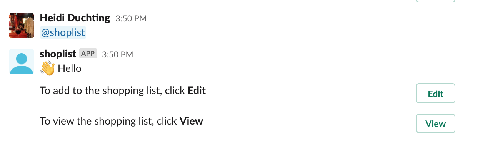
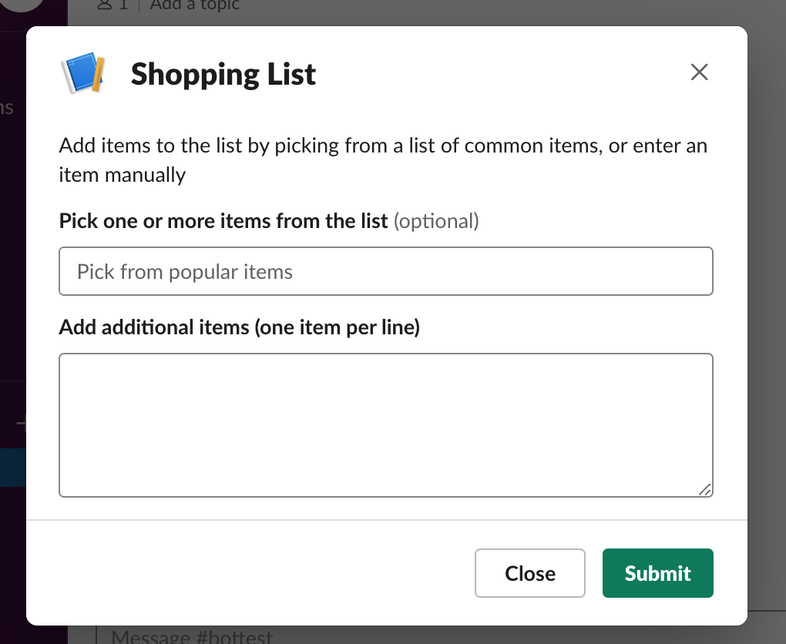
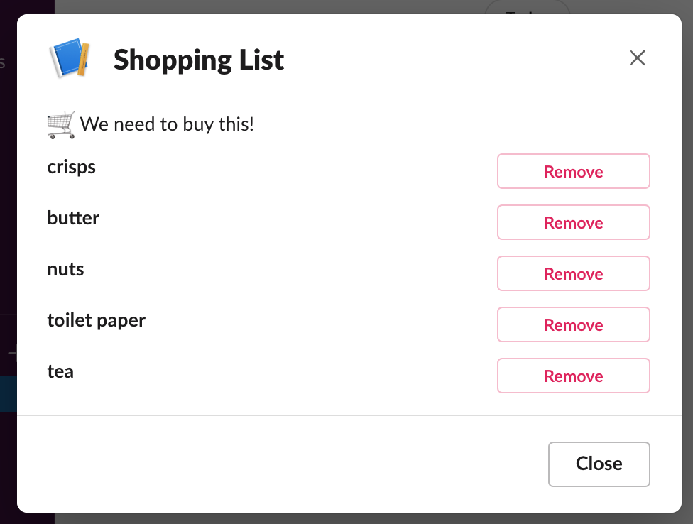

# ShoppingList Slack Bot
This is a little project to get familiar with some slack bot basics.  
This slack bot can be used to create, maintain and view a simple groceries shopping list.

## Install
1) The project uses node.js and npm.  Download and install node.js following the steps listed [here](https://nodejs.org/en/download/).  
2) Clone this github repo
3) in a terminal, run `cd app && npm install` to install the required packages.
4) In a terminal, run `cd app && npm start` to start the application.
5) You also need to set up a Slack app via the Slack App configuration page. see [HowTo](./HowTo.md) for some basic steps.

## How to use
1) Once your bot has been installed to your Slack workspace, you can at-mention it:

2) You can select between two options, **View** or **Edit**.
'View' lets you view your list, as well as remove items from it.  
'Edit' lets you add new items to the list.  

 

## Slack app dev basics
I have listed some generic steps for developing slack apps in the [HowTo](./HowTo.md) document.